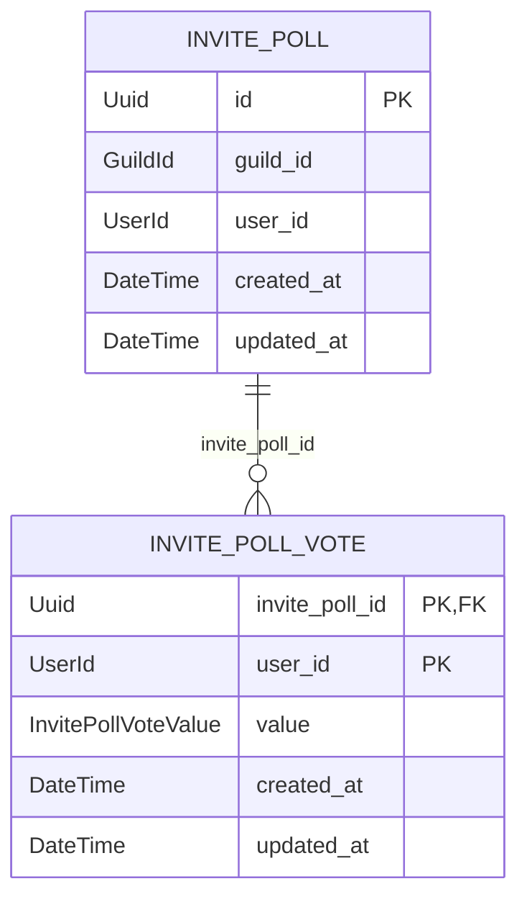

# Database

```mermaid
erDiagram
    INVITE_POLL {
        Uuid id PK
        GuildId guild_id
        UserId user_id
        DateTime created_at
        DateTime updated_at
    }

    INVITE_POLL_VOTE {
        Uuid invite_poll_id PK, FK
        UserId user_id PK
        InvitePollVoteValue value
        DateTime created_at
        DateTime updated_at
    }

    INVITE_POLL ||--o{ INVITE_POLL_VOTE : "invite_poll_id"
```
