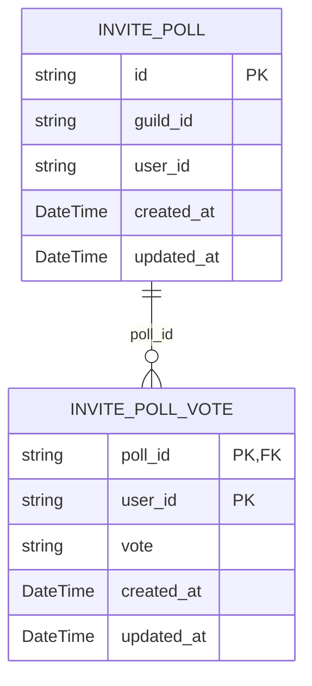

# Database

```mermaid
erDiagram
    INVITE_POLL {
        string id PK
        string guild_id
        string user_id
        DateTime created_at
        DateTime updated_at
    }

    INVITE_POLL_VOTE {
        string poll_id PK, FK
        string user_id PK
        string vote
        DateTime created_at
        DateTime updated_at
    }

    INVITE_POLL ||--o{ INVITE_POLL_VOTE : "poll_id"
```
